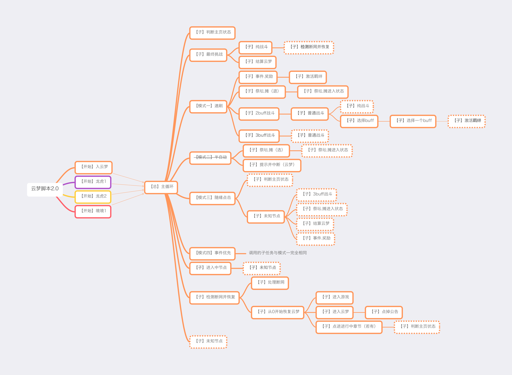

# 自用脚本指南

* [使用方法](#使用方法)
* [调用关系图](#调用关系图)
* [移植后需要重新设置的地方](#移植后需要重新设置的地方)

# 使用方法

1. 如果分辨率是2800x1968，可直接使用
2. 如果不是，需要自己手打一遍，重新配置对应的任务们。
3. 配置好之后，后续就是找到对应章节的起始任务，点击开始执行就行。起始任务总共以下：
    1. **【开始】入云梦**
    2. **【开始】龙虎1**
    2. **【开始】龙虎2**
    3. **【开始】镜境1**

# 调用关系图

# 移植后需要重新设置的地方

- 重新截图：**重新截图前注意匹配区域是否已有数值!!!**（必须在重新截图前看，否则截图完后匹配区域会自动被重置为"
  录制时的屏幕区域"）
    - 如果有点击偏移也需重设
- 重新点击：根据提示的位置重新设置点击坐标

如果之前已经配置好同一任务的同一步骤了，再次遇到的时候不知道再配置，可以单独执行试试配置是否普适。

关于所有任务的详细介绍，请打开[子任务介绍](docs/subtasks.md)。
例如，具体的点击位置，也可在里面找到。

## 打开游戏后

* 重新点击
    * 【子】进入游戏：点击

### 点出"开始游戏"时

* 重新截图
    * 【子】进入游戏：开始游戏
* 重新点击
    * 【子】进入游戏：点击开始游戏

### ！然后点右上角公告！
* 重新截图
  * 【子】点掉公告：有公告吗？、点掉公告

## 进入游戏主页

* 重新截图
    * 【子】进入云梦：是否还在主页
* 重新点击
    * 【子】进入云梦：活动

## 点开"活动"

* 重新截图
    * 【子】进入云梦：云梦、划到底了
* 重新录手势
    * 【子】进入云梦：滑两格

## 进入云梦活动主页

* 重新截图
    * 【开始】入云梦：点大章、进入挑战
    * 【开始】龙虎1：点大章、进入挑战
    * 【开始】龙虎2：点大章、进入挑战
    * 【开始】镜境1：点大章、有无章节1、进小节
    * 【子】判断主页状态：在活动页
* 重新录手势
    * 【开始】镜境1：手势滑动

### 点开一个章节，然后"暂时离开"

* 重新截图
    * 【子】点进进行中章节（若有）：进行中

## 进入节点选择页

* 重新点击
    * 3个节点一行时：
        * 【模式三】随缘点击：3-1、3-2、3-3
    * 2个节点一行时：
        * 【模式三】随缘点击：2-1、2-2

### 没有进行中节点时

* 重新截图
    * 【子】判断主页状态：没打开

### 有进行中节点时

如果有战斗、精英战斗、阶段挑战节点，点开它们之后马上退出，回到节点选择页面

* 重新截图
    * 【子】判断主页状态：已打开
    * 【子】进入中节点：进入节点

### 事件

* 重新截图
    * 【模式一】速刷：事件 in 选择
    * 【模式四】事件优先：事件 in 选择
    * 【模式二】半自动：事件 in 选择

#### 点开之后，出现台词时

* 重新点击：
    * 【子】事件.奖励：点掉台词

#### 出现奖励时

* 重新截图
    * 【子】事件.奖励：是否开始奖励
* 重新点击：
    * 【子】事件.奖励：点掉奖励

### 如果激活了羁绊

* 重新截图
    * 【子】激活羁绊： 激活了就点

### 奖励

* 重新截图
    * 【模式一】速刷：奖励 in 选择
    * 【模式四】事件优先：奖励 in 选择
    * 【模式二】半自动：奖励 in 选择

#### 点开之后，出现台词时

* 重新点击：
    * 【子】事件.奖励：点掉台词

#### 出现奖励时

* 重新截图
    * 【子】事件.奖励：是否开始奖励
* 重新点击：
    * 【子】事件.奖励：点掉奖励

### 如果激活了羁绊

* 重新截图
    * 【子】激活羁绊： 激活了就点

### 祭坛

* 重新截图
    * 【模式一】速刷：祭坛
    * 【模式四】事件优先：祭坛
    * 【模式二】半自动：祭坛

#### 点开之后

* 重新截图
    * 【子】祭坛.摊进入状态：是否已进入
    * 【子】祭坛.摊（退）：返回

### 方士小摊

* 重新截图
    * 【模式一】速刷：方士小摊 in 选择
    * 【模式四】事件优先：方士小摊 in 选择
    * 【模式二】半自动：方士小摊 in 选择

#### 点开之后

* 重新截图
    * 【子】祭坛.摊进入状态：是否已进入
    * 【子】祭坛.摊（退）：返回

### 战斗

* 重新截图
    * 【模式一】速刷：战斗 in 选择
    * 【模式四】事件优先：战斗 in 选择
    * 【模式二】半自动：战斗 in 选择

### 点开之后

* 重新截图
    * 【子】纯战斗：开始、结束战斗

### 选择buff阶段

* 重新截图
    * 【子】选择一个buff：选择界面（2）、确认

#### 若激活了羁绊

* 重新截图
    * 【子】激活羁绊： 激活了就点

### 精英战斗

* 重新截图
    * 【模式一】速刷：精英/阶段战斗
    * 【模式四】事件优先：精英/阶段战斗
    * 【模式二】半自动：精英战斗

### 点开之后

* 重新截图
    * 【子】纯战斗：开始、结束战斗

### 选择buff阶段

* 重新截图
    * 【子】选择一个buff：选择界面（3）、确认

#### 若激活了羁绊

* 重新截图
    * 【子】激活羁绊： 激活了就点

### 阶段挑战

* 重新截图
    * 【模式一】速刷：精英/阶段战斗
    * 【模式四】事件优先：精英/阶段战斗
    * 【模式二】半自动：阶段挑战

### 点开之后

* 重新截图
    * 【子】纯战斗：开始、结束战斗

### 选择buff阶段

* 重新截图
    * 【子】选择一个buff：选择界面（3）、确认

#### 若激活了羁绊

* 重新截图
    * 【子】激活羁绊： 激活了就点

### 最终挑战

* 重新截图
    * 【子】最终挑战：最终挑战 in 任务
* 重新点击
    * 【模式三】随缘点击：final

### 点开之后

* 重新截图
    * 【子】纯战斗：开始、结束战斗

### 战斗完之后

* 重新点击
    * 【子】结算云梦：点掉结算

#### 结算结果出来后

* 重新截图
    * 点确定

## 断网时

等弹出窗口

### 弱网窗口

* 重新截图
    * 【子】处理断网：弱网提示、返回登录

### 网络全断窗口

* 重新截图
    * 【子】处理断网：全断、确定