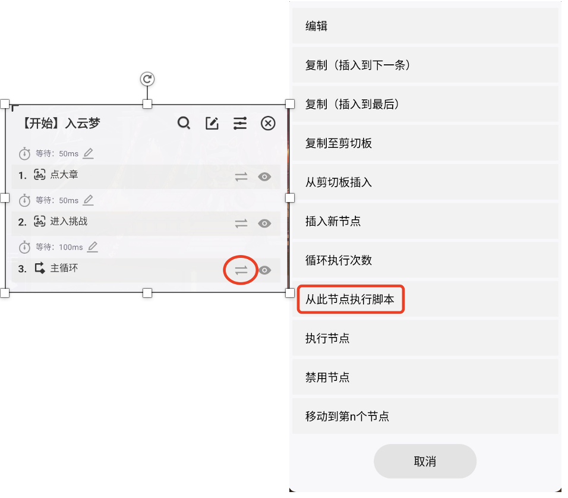
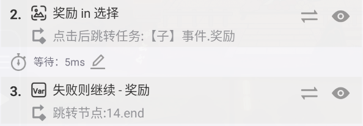
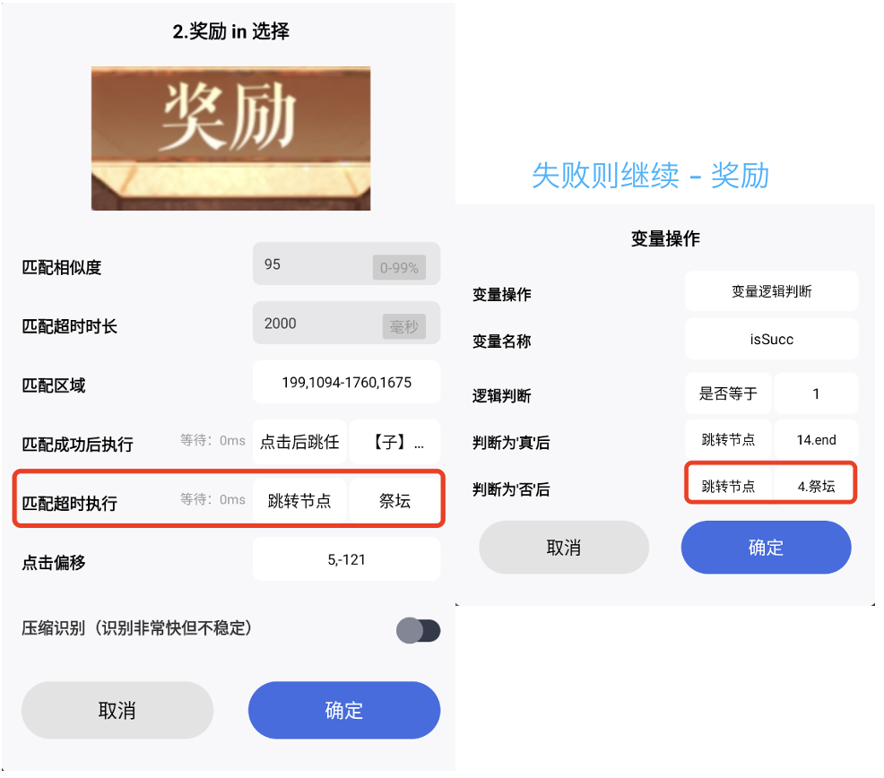
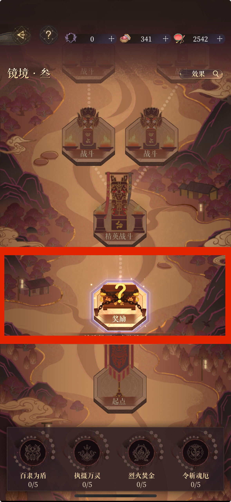

# 自用脚本指南
* [使用方法](#使用方法)
* [进阶用法](#进阶用法)
  * [模式选择](#模式选择)
  * [自定义新模式](#自定义新模式)

# 使用方法

1. 如果分辨率是2800x1968，可直接使用
2. 如果不是，需要自己手打一遍，重新配置对应的任务们。
3. 配置好之后，后续就是找到对应章节的起始任务，点击开始执行就行。起始任务总共有3个：
    1. **【开始】入云梦**
    2. **【开始】龙虎2**
    3. **【开始】镜境1**

# 进阶用法
## 模式选择

位置在 **【总】主循环任务** 里

### 模式一
全自动速刷模式，节点选择以省时为主，祭坛和方士小摊自动退出，适用于刷煤玉，优先级：奖励>祭坛>方士小摊>事件>战斗>精英战斗

### 模式二
半自动模式，适合像我一样练度不太高，精英战斗以下可以全自动，阶段挑战和最终挑战要手动打的初级广陵王。祭坛自动退出、方士小摊会暂停让你可以买buff、阶段挑战会暂停让你手动打。 

**优先级：** 事件>战斗>精英战斗>方士小摊>奖励>祭坛
- 如果方士小摊需要自动退出，找到对应模式任务（例如，模式二的任务叫 **【模式二】半自动**），里的“方士小摊 in 选择”步骤，把它识别成功后跳转的任务改成 **【子】祭坛.摊（退）** 即可。
- 同理，如果祭坛也想手动选，把“祭坛”步骤跳转的任务改成 **【子】祭坛.摊（选）**
- 手动打完和选择完之后，回到节点选择的主页（**注意不要选择任何节点！**），点开章节选择任务（例如：**【开始】入云梦**），从“主循环”步骤开始执行
        
    
        

## 自定义新模式

把模式任务复制一遍，在新生成的任务里修改。

在该任务里每个任务都对应两个步骤，第一个步骤是识别（叫它步骤一），第二个步骤是判断是否成功执行（叫它步骤二）。例如，对于“奖励”节点，步骤一是“奖励 in 选择”，步骤二是“失败则继续 - 奖励”。

修改优先级顺序的方法如下：

1. 把最高优先级的节点对应的2个步骤移到最前面。
2. 把（1）步骤一的匹配超时跳转和（2）步骤二的判断为否跳转的节点，设置成下一个优先级的节点的步骤一。
    1. 例如，我想把事件放在奖励后面，就把“奖励 in 选择”的匹配超时和“失败则继续 - 奖励”的判断为否时跳转都设置成“事件 in 选择”。
        
        
        
3. 对优先级最低的节点，它后面跳转的节点设置成“end”。

# 移植后需要重新设置的地方

- 重新截图：**重新截图前注意匹配区域是否已有数值!!!**（必须在重新截图前看，否则截图完后匹配区域会自动被重置为"录制时的屏幕区域"） 
  - 如果有点击偏移也需重设
- 重新点击：根据提示的位置重新设置点击坐标

## 章节选择阶段

- **【开始】入云梦**
    - 重新截图：“点大章”、“进入挑战”
- **【开始】龙虎2**
    - 重新截图：“点大章”、“进入挑战”
- **【开始】镜境1**
    - 重新截图：“点大章”、“有无章节1”、“进小节”、“进入挑战”
    - “点大章”：重新截图设置区域
    - ：重新截图设置区域
    - “手势滑动”：重新录制手势
    - ：重新截图设置区域

## 刚进入章节主页时

- **【子】判断主页状态**
    - 重新截图：“没打开”（必要）、“已打开”（可选）

## 遇到各个节点时

下面列出了遇到各个节点时可以配置的子任务，具体配置方式见下一小节。

- 奖励
    - **【模式一】速刷**（“奖励 in 选择”）、**【模式二】半自动**（“奖励 in 选择”）、**【子】事件.奖励**
    - 激活羁绊时：**【子】激活羁绊**
- 祭坛
    - **【模式一】速刷**（“祭坛”）、**【模式二】半自动**（“祭坛”）、**【子】祭坛.摊进入状态**、**【子】祭坛.摊（退）**
- 方士小摊
    - **【模式一】速刷**（“方士小摊 in 选择”）、**【模式二】半自动**（“方士小摊 in 选择”）、**【子】祭坛.摊进入状态**、**【子】祭坛.摊（退）**
    - 买了buff且激活了羁绊时：**【子】激活羁绊**
- 事件
    - **【模式一】速刷**（“事件 in 选择”）、**【模式二】半自动**（“事件 in 选择”）、**【子】事件.奖励**
    - 激活羁绊时：**【子】激活羁绊**
- 战斗
    - **【模式一】速刷**（“战斗 in 选择”）、**【模式二】半自动**（“战斗 in 选择”）、**【子】纯战斗**（“开始”、“结束战斗”）、**【子】选择buff**（“选择界面（2）”、“确认”）
    - 激活羁绊时：**【子】激活羁绊**
- 精英战斗
    - **【模式一】速刷**（“精英/阶段战斗”）、**【模式二】半自动**（“精英战斗”）、**【子】纯战斗**（“开始”、“结束战斗”）、**【子】选择buff**（“选择界面（3）”、“确认”）
    - 激活羁绊时：**【子】激活羁绊**
- 阶段挑战
    - **【模式一】速刷**（“精英/阶段战斗”）、**【模式二】半自动**（“阶段挑战”）、**【子】纯战斗**（“开始”、“结束战斗”）、**【子】选择buff**（“选择界面（3）”、“确认”）
    - 激活羁绊时：**【子】激活羁绊**
- 最终挑战
    - **【子】最终挑战**

### 子任务需要重新配置的地方

- **【模式一】速刷**
    
    保证没有节点在进行中状态下，注意截图区域选择"请选择下一步路线吧"上面一排节点的位置。
    
    
    - 重新截图：“奖励 in 选择”、“祭坛”、“方士小摊 in 选择”、“事件 in 选择”、“战斗 in 选择”、“精英/阶段战斗”
- **【模式二】半自动**
    
    保证没有节点在进行中状态下，注意截图区域选择"请选择下一步路线吧"上面一排节点的位置（同上）。
    
    - 重新截图：“事件 in 选择”、“奖励 in 选择”、“祭坛”、“方士小摊 in 选择”、“战斗 in 选择”、“精英战斗”、“阶段挑战”
- **【子】事件.奖励**（事件、奖励节点）
    - 重新截图：是否开始奖励
    - 重新点击：
        - “点掉台词”：主页里左上角大章名字的位置，或其他能点掉剧情的位置
        - “点掉奖励”：“点击空白处关闭”的位置，或其他能同时点掉buff奖励和煤玉奖励的位置
        - （可选）：如果一直得不到奖励，就判断事件或者奖励节点没点成功，重试次数默认为5，如果需要加速，可以设置小一点，在“retry太多则失败”步骤里。
    - 如果此时激活了组合buff，为子任务“**【子】激活羁绊**”重新设置。
- **【子】激活羁绊**（事件、奖励、战斗、方士小摊节点都可能遇到）
    - 重新截图：“激活了就点”
- **【子】祭坛.摊进入状态**（祭坛、方士小摊节点）
    - 重新截图：“是否已进入”
- **【子】祭坛.摊（退）**（祭坛、方士小摊节点）
    - 重新截图：“返回”
    - （可选）：如果“返回”使用图片识别总是失败，也可以选择把这步图片识别直接改成在固定位置点击
- **【子】纯战斗**（战斗、精英战斗、阶段挑战、最终挑战）
    - 重新截图：“开始”、“结束战斗”
- **【子】选择buff**（战斗、精英战斗、阶段挑战、最终挑战）
    - 这个子任务要配2次，第一次在“战斗”节点战斗结束后：
        - 重新截图：“选择界面（2）”、“确认”（重配一次就行）
    - 第二次在“精英战斗“、”阶段挑战“、”最终挑战”任意3buff战斗结束后：
        - 重新截图：选择界面（3）、“确认”（重配一次就行）
- **【子】最终挑战**
    - 重新截图：“最终挑战 in 任务”、“点通关”、“点确定”
    - 重新点击：“点掉结算”