# 任务介绍

* [入口节点](#入口节点)
    * [【开始】入云梦](#开始入云梦)
    * [【开始】龙虎1](#开始龙虎1)
    * [【开始】龙虎2](#开始龙虎2)
    * [【开始】镜境1](#开始镜境1)
* [【总】主循环](#总主循环)
* [模式](#模式)
    * [【模式一】速刷](#模式一速刷)
    * [【模式二】半自动](#模式二半自动)
    * [【模式三】随缘点击](#模式三随缘点击)
    * [【模式四】事件优先](#模式四事件优先)
* [子任务](#子任务)
    * [【子】判断主页状态](#子判断主页状态)
    * [【子】最终挑战](#子最终挑战)
    * [【子】纯战斗](#子纯战斗)
    * [【子】结算云梦](#子结算云梦)
    * [【子】事件.奖励](#子事件奖励)
    * [【子】激活羁绊](#子激活羁绊)
    * [【子】祭坛.摊退](#子祭坛摊退)
    * [【子】祭坛.摊进入状态](#子祭坛摊进入状态)
    * [【子】2buff战斗](#子2buff战斗)
    * [【子】普通战斗](#子普通战斗)
    * [【子】选择buff](#子选择buff)
    * [【子】选择一个buff](#子选择一个buff)
    * [【子】3buff战斗](#子3buff战斗)
    * [【子】祭坛.摊选](#子祭坛摊选)
    * [【子】提示并中断（云梦）](#子提示并中断云梦)
    * [【子】未知节点](#子未知节点)
    * [【子】进入中节点](#子进入中节点)
    * [【子】检测断网并恢复](#子检测断网并恢复)
    * [【子】处理断网](#子处理断网)
    * [【子】从0开始恢复云梦](#子从0开始恢复云梦)
    * [【子】进入游戏](#子进入游戏)
    * [【子】进入云梦](#子进入云梦)
    * [【子】点进进行中章节（若有）](#子点进进行中章节若有)

**没写重新配置指南的，都是不需要重新配置的！**

## 入口节点

### 【开始】入云梦

从云梦主页点进《入云梦》章节，并完成整个章节

#### 重新配置指南

##### 重新截图

* 点大章
* 进入挑战

### 【开始】龙虎1

从云梦主页点进《龙虎疑踪》章节的第一小章，并完成整个章节

#### 重新配置指南

##### 重新截图

* 点大章
* 进入挑战

### 【开始】龙虎2

从云梦主页点进《龙虎疑踪》章节的第二小章，并完成整个章节

#### 重新配置指南

##### 重新截图

* 点大章
* 进入挑战

### 【开始】镜境1

从云梦主页点进《龙虎疑踪》章节的第二小章，并完成整个章节

#### 重新配置指南

##### 重新截图

* 点大章
* 有无章节1
* 进小节

##### 重新录手势

* 手势滑动
    * 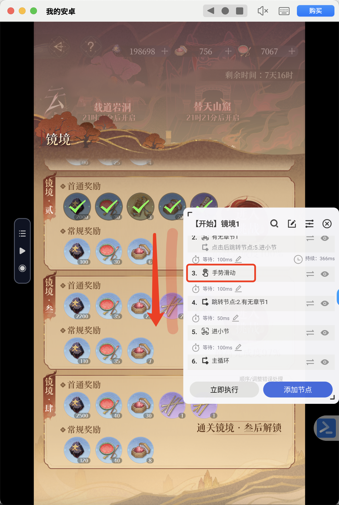

# 【总】主循环

不断点进节点并处理，直到走到最终挑战完成整个章节

* 判断当前页面状态
    * 如果在选节点页面
        * 先尝试最终挑战
            * 如果成功，主循环完成
            * 如果最终挑战失败，下一步
        * 判断是否存在进行中节点
            * 如果存在，处理进行中节点
                * 处理完毕之后，重新判断主页状态
            * 如果没有，下一步
        * 跳转到选择的模式，以固定优先级选择节点
            * 选择完毕之后，重新判断主页状态
    * 如果在云梦活动主页
        * 视为一个章节已完成，结束循环
    * 如果以上页面皆不在，超过一定次数后，
        * 检测是否网络中断，并试图恢复
        * 如果网络没有问题，判断是不是卡在某个节点点开之后的页面了，如果有则处理
        * 检查完后，重新回到判断主页状态的步骤

## 模式

在选择节点页面且无进行中节点时，以指定逻辑（优先级）选择节点并处理

### 【模式一】速刷

优先级：奖励 > 祭坛 > 方士小摊 > 事件> 战斗 > 精英/阶段战斗
以上选择皆失败时会跳转到[【模式三】随缘点击](#模式三随缘点击)。
**注：** 祭坛、方士小摊不会作任何处理直接退出。

#### 重新配置指南

##### 重新截图

* 奖励 in 选择
* 祭坛
* 方士小摊 in 选择
* 事件 in 选择
* 战斗 in 选择
* 精英/阶段战斗

### 【模式二】半自动

优先级：事件 > 战斗 > 精英战斗 > 方士小摊 > 奖励 > 祭坛 > 阶段挑战
以上选择皆失败时会跳转到[【模式三】随缘点击](#模式三随缘点击)。

#### 重新配置指南

##### 重新截图

* 事件 in 选择
* 战斗 in 选择
* 精英战斗
* 方士小摊 in 选择
* 奖励 in 选择
* 祭坛
* 阶段挑战

### 【模式三】随缘点击

在几个固定可能有节点的点位尝试，如果成功点进去某个节点，进行相应处理。
流程是：

* 点击点位
* 成功点击与否
    * 如果成功，结束
    * 如果失败，下一步
* 判断是否还在节点选择页面
    * 如果不在，结束（回到主循环去进行断网检测or恢复处理）
    * 如果在，继续下一个点位
      点位优先级：3-3 > 2-2 > final > 3-2 > 3-1 > 2-1

#### 重新配置指南

##### 重点点击

* 2-1，2-2

  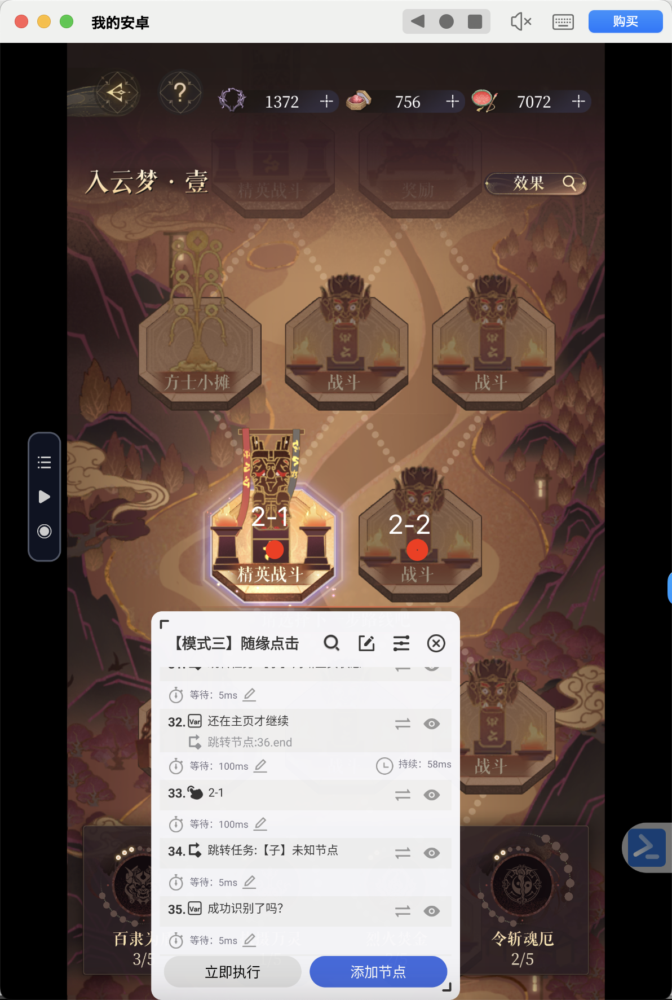

* 3-1，3-2，3-3

  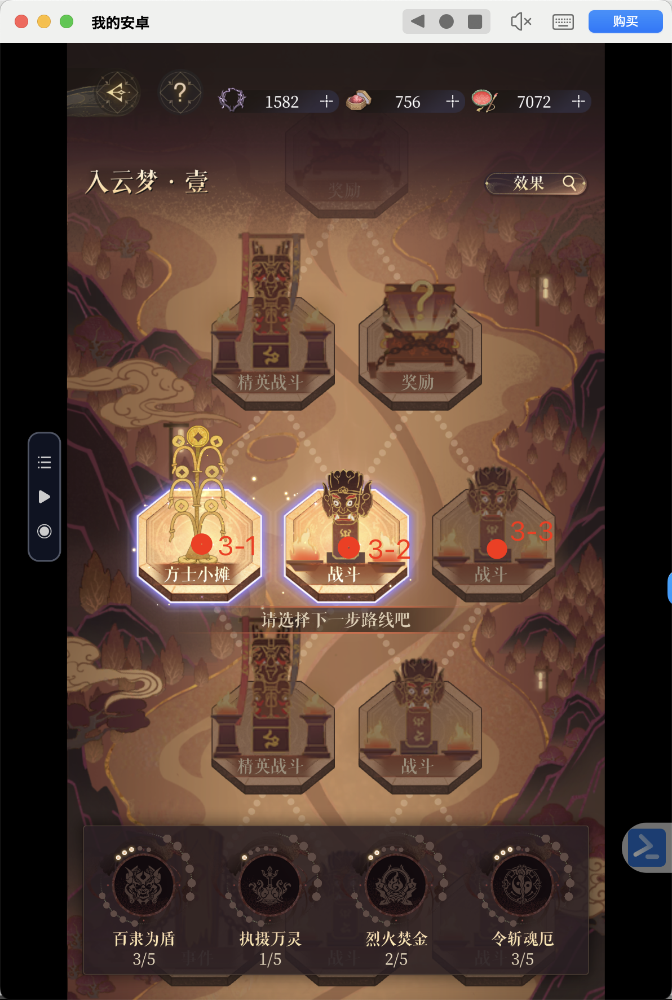

* final

  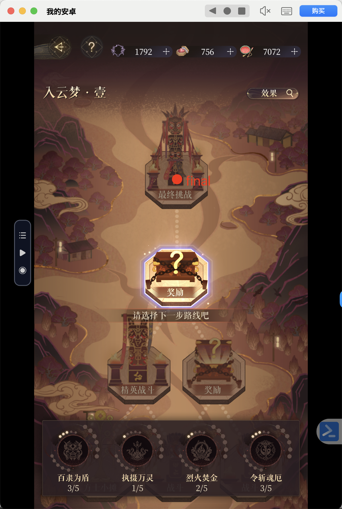

### 【模式四】事件优先

优先级：事件 > 战斗 > 精英战斗 > 奖励 > 祭坛 > 方士小摊 > 阶段挑战

#### 重新配置指南

同模式一

## 子任务

### 【子】判断主页状态

根据主页状态给`searchArea`变量赋值

* 0：在节点选择页，且没有进行中节点
* 1：在节点选择页，但有进行中节点
* -2：在云梦活动主页
* -1：不在属于以上任意一种情况

#### 重新配置指南

##### 重新截图

* 没打开
* 已打开
* 在活动页

### 【子】最终挑战

#### 重新配置指南

##### 重新截图

* 最终挑战 in 任务

##### 重新点击

* 点结算

  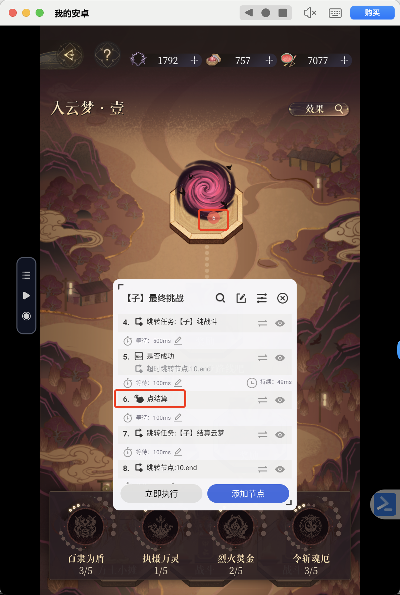

### 【子】纯战斗

如果战斗未开始，点开始
然后一直等到战斗结束，点结束后的确认
如果战斗一直不结束，每隔一定时间会去检查网络

#### 重新配置指南

##### 重新截图

* 开始
* 结束战斗

### 【子】结算云梦

点掉最终挑战后的结算结果。

#### 重新配置指南

##### 重新截图

* 点确定

##### 重新点击

* 点掉结算

  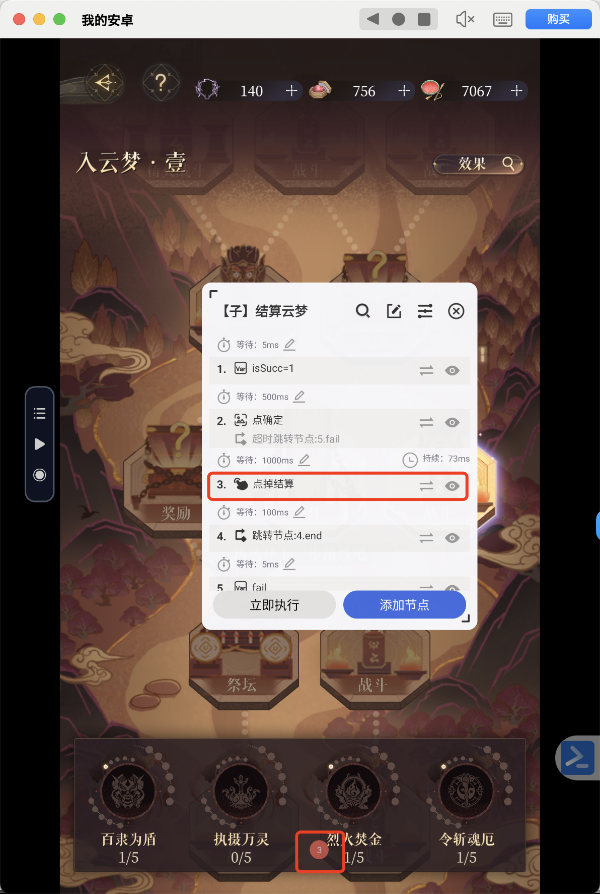

### 【子】事件.奖励

处理事件or奖励节点：

* 一直点击点位1，直到出现奖励，
* 如果点击超过一定次数还没有奖励，视为节点进入失败。
* 出现奖励之后，不断点掉奖励

#### 重新配置指南

##### 重新截图

* 是否开始奖励
    * 注意匹配区域要大一点

##### 重新点击

* 点掉台词

  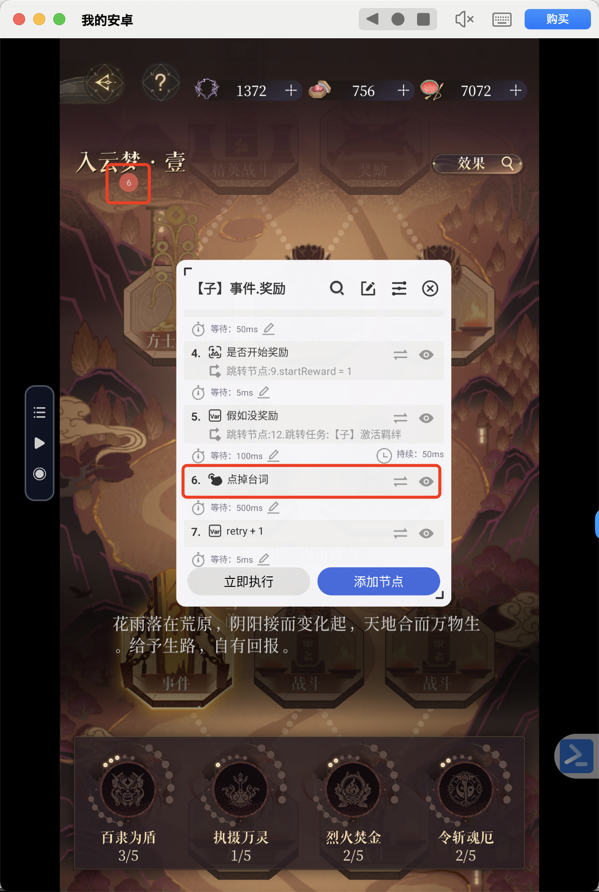

* 点掉奖励

  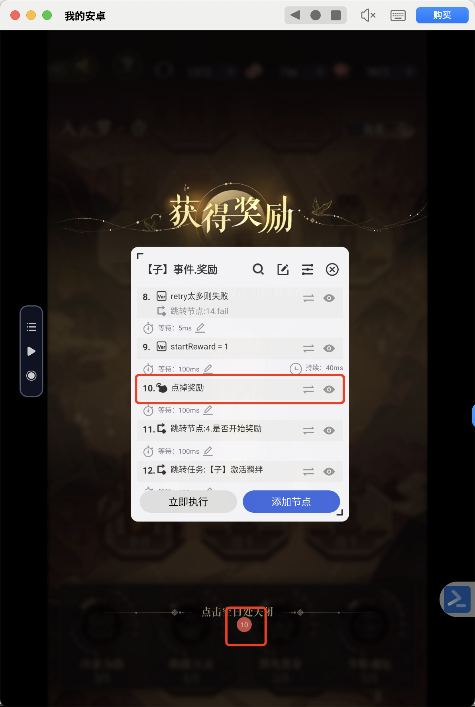

### 【子】激活羁绊

如果显示激活羁绊，点掉

#### 重新配置指南

##### 重新截图

* 激活了就点

### 【子】祭坛.摊（退）

在祭坛or方士小摊页面，直接退出

#### 重新配置指南

##### 重新截图

* 返回
    * **注：** 如果图片识别不出来，可以把图片识别操作换成点击操作试试

### 【子】祭坛.摊进入状态

检测是否进入祭坛or小摊

#### 重新配置指南

##### 重新截图

* 是否已进入

### 【子】2buff战斗

处理给2个buff的战斗

### 【子】普通战斗

处理会给buff的战斗。
先战斗，结束后判断有没有buff，然后点掉它们

### 【子】选择buff

有两种选择方式：

* buff为2个时，选择右边那个
* buff为3个时，选择中间那个

选择逻辑：

* 如果buffCount变量指定为2或3，优先按上述方式选择。
* 如果没给合法的buffCount，优先尝试3个buff。
* 如果发现怎么也点不掉buff，说明buffCount给错了，尝试另一个buffCount，比如第一次试的2，后面就试3。

### 【子】选择一个buff

如果当前页面是要你选择一个buff，选择一个。

#### 重新配置指南

##### 重新截图

* 选择界面（2）
* 选择界面（3）
* 确认

### 【子】3buff战斗

处理给3个buff的战斗

### 【子】祭坛.摊（选）

如果进入祭坛/方士小摊，中断自动脚本，并播放声音提示脚本已中断
用来让大家手动选择要买的buff等，适用于半自动脚本。

### 【子】提示并中断（云梦）

中断自动脚本，并播放声音提示脚本已中断

### 【子】未知节点

当不知道点进去的是什么节点时，自助地判断一下，然后进行相应处理。

### 【子】进入中节点

如果在节点选择页面里，显示已有进行中的节点，重新点进它。

#### 重新配置指南

##### 重新截图

* 进入节点

### 【子】检测断网并恢复

检查是不是网断了，重新登录并恢复到云梦界面

### 【子】处理断网

检测是不是网断了，涵盖两种情况：

* 一种可以等待的弱网状态
* 另一种直接网全断了
  任意一种出现都会把badNetwork赋值为1

#### 重新配置指南

##### 重新截图

* 弱网提示
* 返回登录
* 全断
* 确定

### 【子】从0开始恢复云梦

从游戏初始界面回到节点选择界面（如果章节还在进行中），或者回到云梦主页。

### 【子】进入游戏

从游戏初始界面到游戏主页。

#### 重新配置指南

##### 重新截图

* 开始游戏
* 是否进入主页

  **注：** 由于大家的背景可能选择的不太一定，检测"故事"两个字比较普适

##### 重新点击

* 点击

  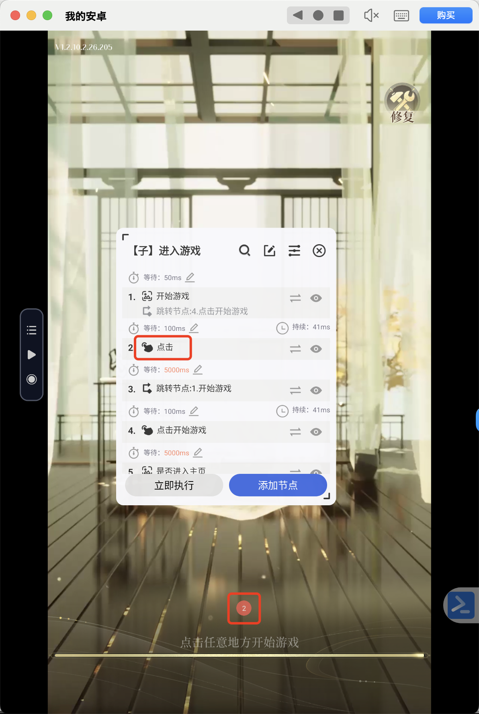

* 点击开始游戏

  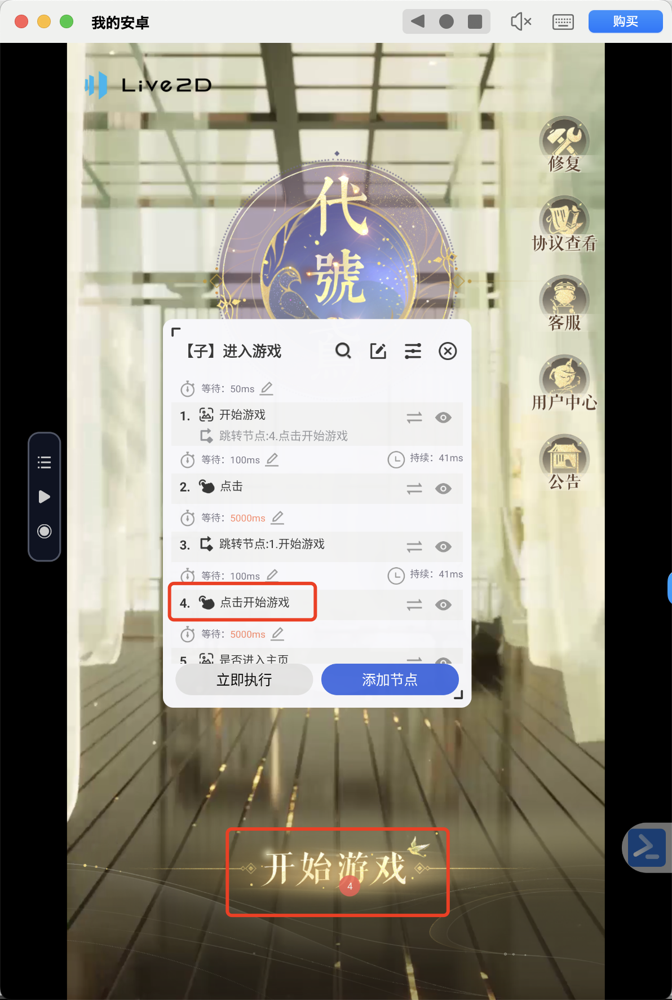

### 【子】进入云梦

如果在游戏主页，从"活动"入口进入云梦活动主页。

#### 重新配置指南

##### 重新截图

* 是否还在主页
* 云梦
* 划到底了

##### 重新点击

* 活动

  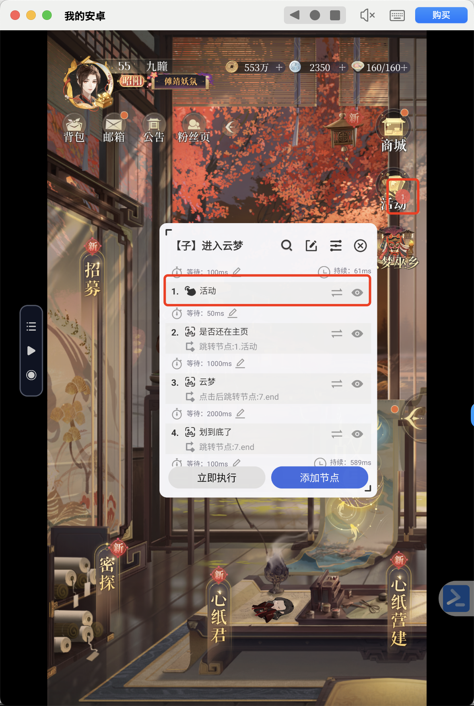

##### 重新录手势

* 滑两格

### 【子】点掉公告

如果在游戏主页，从"活动"入口进入云梦活动主页。

#### 重新配置指南

##### 重新截图

* 有公告吗？
* 点掉公告

### 【子】点进进行中章节（若有）

如果在云梦活动主页有进行中章节，点进去

#### 重新配置指南

##### 重新截图

* 进行中